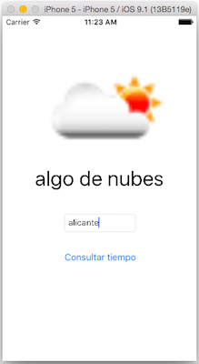

## Ejercicio (3 puntos)

Vamos a realizar una pequeña aplicación para consultar el tiempo meteorológico. La aplicación terminada tendrá el aspecto que se muestra en la figura



### A. Creación de la interfaz

Como se ve en la figura, la interfaz tiene 4 componentes, seleccionables mediante el panel de componentes gráficos de la esquina inferior derecha de Xcode:
- Una imagen (*image view*), para mostrar un icono con el estado del tiempo. Inicialmente estará vacía
- Una etiqueta (*label*), para mostrar el estado del tiempo de forma textual. Inicialmente estará vacía
- Un campo de texto de 1 línea, para teclear la localidad (*text field*)
- Un botón pulsable (*button*) que pondrá “Consultar tiempo” 

Como ya hiciste en la aplicación de UADivino, conecta los componentes de la interfaz con el `ViewController`:

- **Outlets:** recuerda que son componentes de la interfaz a los que quieres acceder para consultar/modificar sus propiedades. Se crean con `Ctrl+arrastrar` desde el componente hasta el `ViewController.swift`. **Crea *outlets* para la imagen, la etiqueta y el campo de texto**
- **Action:** recuerda que sirve para ejecutar tu código en respuesta a eventos sobre la interfaz. Se crean igual que los *outlets*. Cada *action* genera un método. **Crea un *action* para el botón de “consultar tiempo”**

### B. Consulta del tiempo en la consola de depuración (0.5 puntos)

El estado del tiempo nos lo da un servicio externo, [Openweathermap](https://openweathermap.org/), que además de la web ofrece la [API](https://openweathermap.org/api) que vamos a usar.

Para obtener el tiempo en una localidad, con los mensajes traducidos a español y usando unidades del sistema métrico, hay que hacer una petición HTTP a la URL `http://api.openweathermap.org/data/2.5/weather?lang=es&units=metric&app_id=<TU_API_KEY>&q=`concatenándole la localidad a buscar. El parámetro `app_id` debe contener nuestra API key (nuestra clave de desarrollador, podéis daros de alta para obtener la vuestra propia). Por ejemplo si clicas en [este enlace](http://api.openweathermap.org/data/2.5/weather?lang=es&units=metric&appid=1adb13e22f23c3de1ca37f3be90763a9&q=Alicante) verás el tiempo para Alicante. El API devuelve los datos en formato JSON, que habrá que  analizar para extraer la información que nos interese.

> IMPORTANTE: la última versión de iOS tiene una característica llamada “Application Transport Security”, que impide realizar peticiones HTTP desde el código. Solo se pueden hacer peticiones HTTPS. Para poder saltarnos esta restricción tenemos que modificar el archivo `info.plist` del proyecto:
	> Pulsa con el botón derecho sobre dicho archivo y elige `Open As > Source Code`.
	> Despúes de la etiqueta `<dict>` de la línea 4 inserta estas líneas:


```xml
<key>NSAppTransportSecurity</key>
<dict>
   <key>NSAllowsArbitraryLoads</key><true/>
</dict>
```

Para hacer una petición HTTP en iOS podemos usar la clase `URLSession`. Copia el siguiente código en el `ViewController.swift`

```swift
let OW_URL_BASE = "http://api.openweathermap.org/data/2.5/weather?lang=es&units=metric&appid=1adb13e22f23c3de1ca37f3be90763a9&q="
let OW_URL_BASE_ICON = "http://openweathermap.org/img/w/"

func consultarTiempo(localidad:String) {
    let urlString = OW_URL_BASE+localidad
    let url = URL(string:urlString)
    let dataTask = URLSession.shared.dataTask(with: url!) {
        datos, respuesta, error in
           let jsonStd = try! JSONSerialization.jsonObject(with: datos!, options: JSONSerialization.ReadingOptions.mutableContainers) as! [String:AnyObject]
           let weather = jsonStd["weather"]! as! [AnyObject]
           let currentWeather = weather[0] as! [String:AnyObject]
           let descripcion = currentWeather["description"]! as! String
           print("El tiempo en \(localidad) es: \(descripcion)")
           //Estamos bajándonos la imagen pero todavía no la usamos
           let icono = currentWeather["icon"]! as! String
           if let urlIcono = URL(string: self.OW_URL_BASE_ICON+icono+".png" ) {
              let datosIcono = try! Data(contentsOf: urlIcono)
              let imagenIcono = UIImage(data: datosIcono)
           }
}
    dataTask.resume()
}

```

Aunque no esté explícito en el código anterior, `URLSession` lanza la petición en *background* cuando se ejecuta el `resume` y cuando llega la respuesta del servidor se ejecuta el código de la clausura

En el **action** asociado al botón de "consultar tiempo" debes obtener el texto del campo de texto (propiedad `text`) y llamar a la función `consultarTiempo` que acabas de copiar y pegar, pasándole este dato.

Si pruebas la aplicación y todo ha ido bien, debería aparecer el estado del tiempo en la consola. Haz un commit con el comentario "Apartado B"

### C. Mostrar el tiempo en la interfaz (1 punto)

Añade código que muestre el tiempo en la interfaz del móvil. Lo primero que puedes hacer es mostrarle al usuario que se está haciendo una operación de red, esto lo puedes hacer con un *spinner* que puedes hacer aparecer automáticamente en la barra de *status* de la parte superior. Para poner el *spinner* harías:

```swift
UIApplication.shared.isNetworkActivityIndicatorVisible = true
```

y para quitarlo, idem pero asignándole `false`

**Pon en marcha el *spinner* justo antes del `dataTask.resume()` y luego páralo una vez se haya cargado el icono del tiempo** (la línea `let imagenIcono = UIImage(data: datosIcono)`). Pero recuerda que **La interfaz solo se puede "tocar" desde la cola de operaciones principal. La llamada a `dataTask.resume()` está en esta cola, pero el código que parsea los datos del tiempo está en *background*, como hemos dicho. Tendrás que acceder desde allí a la cola principal para parar el *spinner*.

Si el *spinner* no se ve porque la respuesta del servidor llega demasiado rápido, puedes probar a poner un `sleep(segundos)` con el número de segundos que quieras, para parar artificialmente la ejecución.

Una vez solucionado el tema del *spinner* añade código para actualizar el `label` y la `image`. De nuevo recuerda que estas operaciones debes hacerlas desde la cola principal.

Haz un *commit* poniendo como comentario "Apartado C".

### D. Gestión de errores en Swift (0.5 puntos)

Verás que el código que has copiado y pegado tiene un par de llamadas con `try!`. Aquí lo que estamos diciendo es que estas funciones podrían fallar pero **Sabemos que no lo van a hacer**. Quita la admiración de los `try` y mira qué sucede. ¿Cómo podrías arreglar el código para que compile y funcione como antes sin volver a poner el `!`?. Hazlo y haz un *commit* poniendo como comentario "apartado D".


### E. Delegates y protocols (1 punto)

**Vamos a hacer que en el campo de texto no se puedan introducir caracteres numéricos**.

En iOS los campos de texto pueden tener un objeto *delegate* al que el campo de texto le va "avisando" de las cosas que ocurren en su "ciclo de vida" (se ha empezado a escribir, se ha terminado de escribir, se ha insertado texto ...). Este objeto debe ser conforme al protocolo `UITextFieldDelegate`. Aprovecharemos cuando el campo nos avise de que el usuario está escribiendo texto para rechazarlo si es numérico.

Vamos a convertir el `ViewController.swift` en *delegate* del campo de texto, para ello hay que:

- Especificar en la cabecera de `ViewController` que es una clase conforme al protocolo `UITextFieldDelegate`. Mira las transparencias para ver cómo se pone esto
- En el método `viewDidLoad` le decimos al campo de texto que somos su *delegate* (fijamos su propiedad `delegate` a `self`)
- El campo de texto nos avisará de que el usuario ha escrito un carácter nuevo (o ha borrado uno), llamando a un método

```swift
func textField(_ textField: UITextField, shouldChangeCharactersIn range: NSRange, replacementString string: String) -> Bool {
   //código del método
}
```

Tendremos que definir este método y escribir su código, teniendo en cuenta que el parámetro `string` es el nuevo texto que el usuario pretende insertar. Y que si devolvemos `true` dejamos que el texto se inserte, pero si devolvemos `false` no lo permitimos. Comprueba si se puede convertir el parámetro `string` a entero y si se puede devuelve `false` (no dejamos escribir). En caso contrario, devuelve `true`.

Una vez hecho y comprobado que funciona, haz un *commit* con el comentario "Apartado E"

