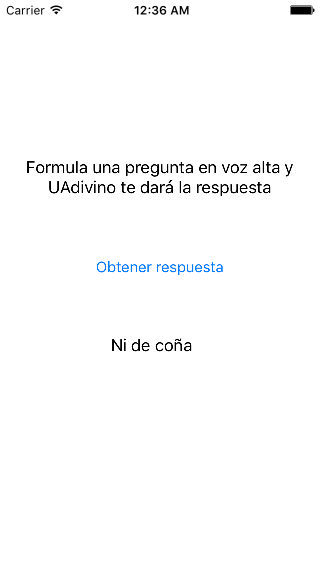

# Ejercicios de las sesiones 1 y 2. 
# Introducción al desarrollo iOS con Swift


Vamos a implementar una pequeña aplicación que funciona de forma similar a la típica "bola 8". Formulamos una pregunta en voz alta, y nuestro "adivino", al pulsar un botón nos dará una respuesta positiva o negativa. Algo como la siguiente imagen



Vamos a hacer un par de versiones según vayamos viendo características de Swift, y luego ampliaremos la aplicación.

> Las dos primeras versiones de la aplicación serán desarrolladas de forma guiada, se dejará el código en la web por si lo necesitáis. A partir de ahí tendréis que añadir una nueva funcionalidad e internacionalizar la aplicación.

## Ejercicio 1. Aplicación `UAdivino` con Swift sin orientación a objetos

Necesitamos alguna clase donde poder colocar nuestro código. Vamos a hacerlo en el `ViewController`, que en el MVC de iOS es el **controlador***, el pegamento entre vista y modelo.

En la clase `ViewController` añadimos un nuevo método para obtener una respuesta al azar generada por el adivino:

```swift
func obtenerRespuesta() -> String {
    let respuestas = ["Si", "No", "Ni de coña", "Por supuesto!"]
    let indice = Int(arc4random_uniform(UInt32(respuestas.count)))
    return respuestas[indice]
}
```

> Para comprobar que funciona, ve dentro del mismo archivo al método `viewDidLoad()`. Este método se ejecuta cuando se carga la vista asociada al controlador. Escribe allí un bucle que llame a `obtenerRespuesta()` 10 veces y vaya imprimiendo con `print` los valores obtenidos. Así comprobarás si parecen más o menos aleatorios y se corresponden con las respuestas predefinidas.

Lo que hemos escrito antes sería nuestro **modelo**, la lógica de nuestra aplicación. Aunque en este caso es muy sencilla y el modelo un tanto pobre ya que hemos insertado directamente el código en el controlador en lugar de tener un modelo orientado a objetos.

De las tres piezas de MVC nos falta por tanto la **vista**. Para ello abriremos el archivo `Main.storyboard` haciendo clic sobre él. Aparecerá una pantalla en blanco de iPhone. Aquí debemos añadir los componentes gráficos de nuestra aplicación. En la esquina inferior derecha de Xcode podemos seleccionar el componente que necesitemos y "arrastrarlo" hasta la pantalla del *storyboard*. Podemos filtrar la lista de componentes escribiendo en el cuadro de texto de su parte inferior. Necesitamos:

- Un `label` para el mensaje de "Formula una pregunta en voz alta...". Un `label` es un componente que muestra texto que no va a editar el usuario. Puede ser totalmente estático, como en este caso, y también podemos modificar el texto por código, como veremos.
- Un `button` para el "Obtener respuesta".
- Otro `label` para la respuesta del adivino. Como vemos esta no es estática sino que la cambiamos a través de nuestro código de programa.

**Arrastra los tres componentes hasta el lugar adecuado**. Luego edita el texto del primer `label` y del botón para que se correspondan con lo necesario en la aplicación. 

La comunicación entre los elementos de la interfaz y nuestro código se produce en las dos direcciones:

- `action`: es cuando queremos reaccionar a un evento producido sobre la interfaz de usuario. En nuestro caso la única que nos interesa es la pulsación sobre el botón de "Obtener respuesta". Le diremos a Xcode que cuando se produzca el evento llame a determinado método del código del controlador.
- `outlet`: es una variable que representa un elemento de la interfaz de usuario. Leyendo o cambiando sus propiedades podemos cambiar la apariencia o el contenido de este elemento. En nuestro caso nos interesa cambiar el texto de la `label` con la respuesta. 

## Ejercicio 2. Aplicación `UAdivino` con Swift orientado a objetos


## Ejercicio 3. Ampliación de `UAdivino`


