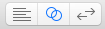
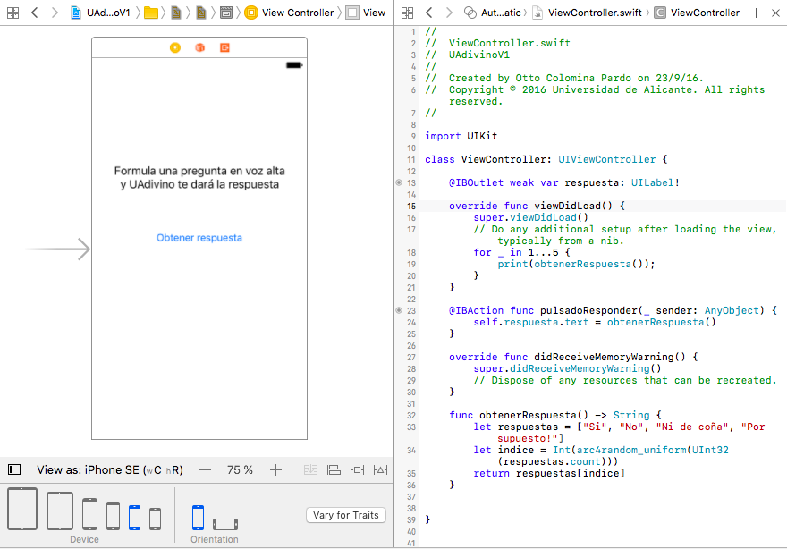

# Ejercicios de las sesiones 1 y 2. 
# Introducción al desarrollo iOS con Swift


Vamos a implementar una pequeña aplicación que funciona de forma similar a la típica "bola 8". Formulamos una pregunta en voz alta, y nuestro "adivino", al pulsar un botón nos dará una respuesta positiva o negativa. Algo como la siguiente imagen


Vamos a hacer un par de versiones según vayamos viendo características de Swift, y luego ampliaremos la aplicación.

> Las dos primeras versiones de la aplicación serán desarrolladas de forma guiada, se dejará el código en la web por si lo necesitáis. A partir de ahí tendréis que añadir una nueva funcionalidad e internacionalizar la aplicación.

## Ejercicio 1. Aplicación `UAdivino` con Swift sin orientación a objetos

Necesitamos alguna clase donde poder colocar nuestro código. Vamos a hacerlo en el `ViewController`, que en el MVC de iOS es el **controlador***, el pegamento entre vista y modelo.

En la clase `ViewController` añadimos un nuevo método para obtener una respuesta al azar generada por el adivino:

```swift
func obtenerRespuesta() -> String {
    let respuestas = ["Si", "No", "Ni de coña", "Por supuesto!"]
    let indice = Int(arc4random_uniform(UInt32(respuestas.count)))
    return respuestas[indice]
}
```

> Para comprobar que funciona, ve dentro del mismo archivo al método `viewDidLoad()`. Este método se ejecuta cuando se carga la vista asociada al controlador. Escribe allí un bucle que llame a `obtenerRespuesta()` 10 veces y vaya imprimiendo con `print` los valores obtenidos. Así comprobarás si parecen más o menos aleatorios y se corresponden con las respuestas predefinidas.

Lo que hemos escrito antes sería nuestro **modelo**, la lógica de nuestra aplicación. Aunque en este caso es muy sencilla y el modelo un tanto pobre ya que hemos insertado directamente el código en el controlador en lugar de tener un modelo orientado a objetos.

De las tres piezas de MVC nos falta por tanto la **vista**. Para ello abriremos el archivo `Main.storyboard` haciendo clic sobre él. Aparecerá una pantalla en blanco de iPhone. Aquí debemos añadir los componentes gráficos de nuestra aplicación. En la esquina inferior derecha de Xcode podemos seleccionar el componente que necesitemos y "arrastrarlo" hasta la pantalla del *storyboard*. Podemos filtrar la lista de componentes escribiendo en el cuadro de texto de su parte inferior. Necesitamos:

- Un `label` para el mensaje de "Formula una pregunta en voz alta...". Un `label` es un componente que muestra texto que no va a editar el usuario. Puede ser totalmente estático, como en este caso, y también podemos modificar el texto por código, como veremos.
- Un `button` para el "Obtener respuesta".
- Otro `label` para la respuesta del adivino. Como vemos esta no es estática sino que la cambiamos a través de nuestro código de programa.

**Arrastra los tres componentes hasta el lugar adecuado**. Luego edita el texto del primer `label` y del botón para que se correspondan con lo necesario en la aplicación. 

La comunicación entre los elementos de la interfaz y nuestro código se produce en las dos direcciones:

- `action`: se usan cuando queremos reaccionar a un evento producido sobre la interfaz de usuario. En nuestro caso la única que nos interesa es la pulsación sobre el botón de "Obtener respuesta". Le diremos a Xcode que cuando se produzca el evento llame a determinado método del código del controlador.
- `outlet`: es una variable que representa un elemento de la interfaz de usuario. Leyendo o cambiando sus propiedades podemos cambiar la apariencia o el contenido de este elemento. En nuestro caso nos interesa cambiar el texto de la `label` con la respuesta. 

Los `action` y los `outlet` se crean de la misma forma. Necesitamos ver simultáneamente el *storyboard* y el código fuente donde queremos crear el `action` o el `outlet`. Para ello se usa el *assistant editor* de Xcode. 

**Estando editando el *storyboard* pasamos al *assistant editor* pulsando sobre el correspondiente botón** de la esquina superior derecha de Xcode



La pantalla se dividirá en dos, para mostrar tanto el *storyboard* como el código Swift que queremos conectar. 



**Para crear el `outlet` asociado al `label` con la respuesta del adivino**, pulsar la tecla `Ctrl` y arrastrar desde el `label` en el *storyboard* hasta un lugar en el código de `ViewController.swift` donde se pueda insertar una nueva propiedad. En el menú *popup* que aparecerá al soltar el botón del ratón seleccionar como `Connection` el tipo `outlet`, y como `name` teclear el nombre que queremos que tenga la nueva propiedad, por ejemplo `respuestaLabel`. En el código fuente aparecerá una nueva propiedad:

```swift
@IBOutlet weak var respuestaLabel: UILabel!
```

**Para crear el `action` asociado al botón "Obtener respuesta"**, hacer lo mismo que con el *outlet*: pulsar la tecla `Ctrl` y arrastrar desde el botón hasta un lugar en el código de `ViewController.swift` donde se pueda insertar un nuevo método.

En el menú *popup* que aparecerá al soltar el botón del ratón seleccionar como `Connection` el tipo `action`, y como `name` teclear el nombre del método que se va a crear en el código, por ejemplo `botonPulsado`. **Aparecerá el esqueleto del método, que debemos rellenar con el código adecuado**. En este caso algo que obtenga una respuesta del adivino al azar y la copie en el texto del `label`. En código iOS un `label` es una instancia de `UILabel` y su propiedad `text` representa el texto.

```swift
self.respuestaLabel.text = obtenerRespuesta()
```

**Comprueba que la aplicación funciona correctamente**. Si es así, haz un `commit` con la opción de menú `Source control > commit... `, con el mensaje "versión 1: sin objetos".


## Ejercicio 2. Aplicación `UAdivino` con Swift orientado a objetos

Vamos a hacer una nueva versión de la aplicación, con código orientado a objetos. Haremos una clase `UAdivino`. Para ello ir a la opción de menú de `File > New > File...` y en el cuadro de diálogo seleccionar `Swift File`. En el siguiente paso llamarlo `UAdivino`. Copiar el siguiente código en el fuente:

```swift
class UAdivino {
    let respuestas = ["Si", "No", "Ni de coña", "Por supuesto!"];

    func obtenerRespuesta() -> String {
        let indice = Int(arc4random_uniform(UInt32(respuestas.count)));
        return respuestas[indice];
    }
}
```

Básicamente es lo mismo que teníamos antes pero encapsulado en una clase. Las posibles respuestas pasan a ser una propiedad de la clase en lugar de estar definidas en el método. 

Debemos modificar el `ViewController` para que use el nuevo código. **Elimina la definición de `func obtenerRespuesta()` que había en `ViewController.swift`**. Ahora nos falta crear una nueva instancia de `UAdivino` cuando se cargue la pantalla asociada al `ViewController`. Para ello, debemos:

- **Añadir una propiedad a la clase `ViewController`** que almacene una instancia de `UAdivino`:

```swift
var miAdivino = UAdivino()
```

- **Escribir el siguiente código en el método `botonPulsado`** (sustituyendo al anterior). Recordemos que este método se dispara automáticamente cuando se pulsa en el botón "Obtener respuesta"

```swift
self.respuestaLabel.text = self.miAdivino.obtenerRespuesta()
```

**Comprueba que la aplicación funciona correctamente**, y si es así haz otro commit con el mensaje "versión 2: con objetos"

## Ejercicio 3. Ampliación de `UAdivino`


